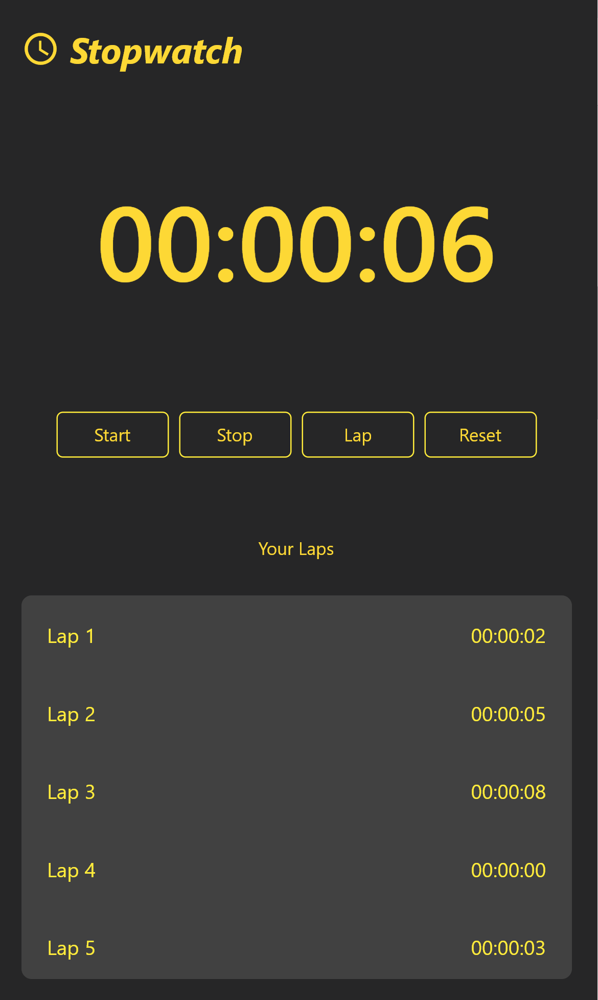
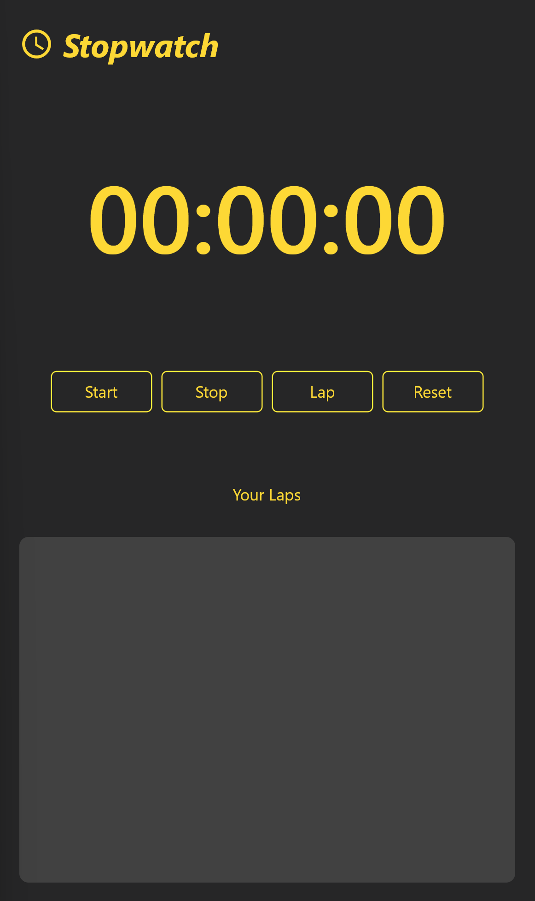

# Stopwatch App

Here is a simple Stopwatch App that I built using Flutter.
My UI is inspired by [Rahmat Raditya](https://dribbble.com/shots/11164774-Clock-Apps-Design-Exploration)

## How to run the app

**Step 1:** Install Flutter on your machine. Refer to the [Flutter](https://docs.flutter.dev/get-started/install) documentation \
**Step 2:** Clone the repo \
**Step 3:** From your VS code terminal run the following

```
flutter run
````

**Step 4:** Next pick a device to emulate the app (You can also install Android Studio and emulate your app on Android devices such as Pixel 4)

## App UI






## Demo video

Here is a live [demo](https://youtube.com/shorts/XUhaYpcWZao?feature=share) of the Stopwatch app.


